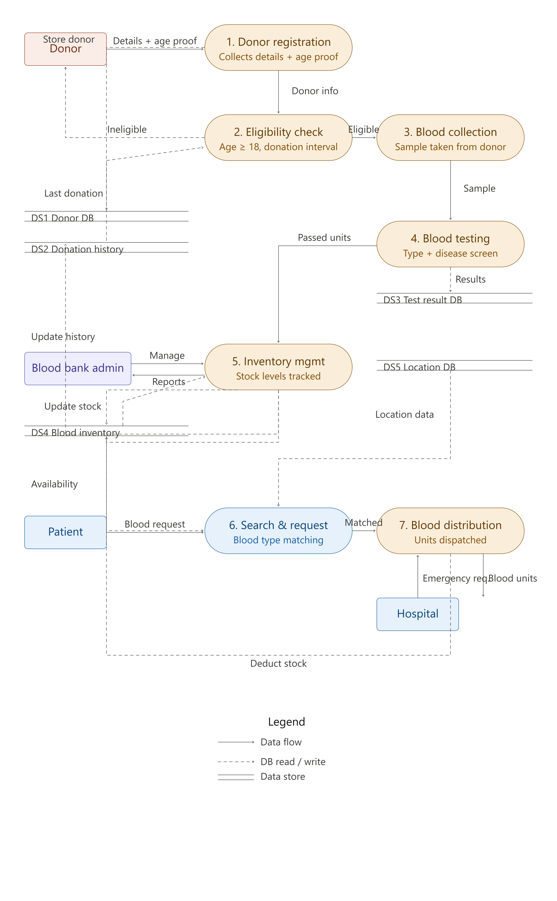

# Bloodbank

## Project Overview
The **Blood Bank Management System** is a real-time, location-based platform designed to efficiently connect blood donors with recipients. It enhances traditional SMS-based systems by integrating **interactive maps**. The system streamlines the donation process, making it faster, more accessible, and more reliable.

## Features
- **User Registration & Authentication**: Secure sign-up and login for donors, recipients, and administrators.
- **Location-Based Search**: Interactive maps displaying donor locations with real-time GPS tracking.
- **Request Management**: Recipients can create blood requests specifying type, urgency, and location.
- **In-App Communication**: Secure messaging and call integration between donors and recipients.
- **Donation History Tracking**: Keeps records of past donations and eligibility periods.
- **Admin Dashboard**: Platform management, user verification, and data security controls.

## Technologies Used
### Front-End:
- HTML, CSS, JavaScript (for UI design)

### Back-End:
- PHP (for server-side logic)
- XAMPP (for local development and testing)

### Database:
- MySQL (for data storage)

## System Architecture
The system follows a **three-tier architecture**:
1. **Presentation Layer**: Web UI built using HTML, CSS, and JavaScript.
2. **Business Logic Layer**: PHP scripts for handling authentication, request matching, and notifications.
3. **Data Access Layer**: MySQL database for managing donor/recipient records and blood bank data.
## Screenshots

#### data flow diagram

## Installation Guide
1. **Clone the Repository:**
   
   git clone (https://github.com/mayeshakader/Bloodbank.git)
   cd blood-bank-management
   
2. **Set Up XAMPP:**
   - Install and configure **XAMPP**.
   - Start **Apache** and **MySQL** services.
3. **Configure Database:**
   - Open `phpMyAdmin` and create a new database.
   - Import the provided SQL file into your database.
4. **Run the Application:**
   - Place project files in the `htdocs` directory of XAMPP.
   - Open a browser and go to `http://localhost/blood-bank-management/`.

## Contribution Guidelines
- **Fork the repository** and create a new branch.
- **Commit your changes** with descriptive messages.
- **Submit a Pull Request** for review.
- Follow **coding standards** and document any new features.

## License
This project is developed for educational and academic purposes.

## Contact
For queries or support, reach out to **mayeshakader13@gmail.com**.

---
**Developed by:** Shahriar Hossain Arafat
                  Mayesha kader
                  Tasmiah binte Iqbal
🚀 *Modernizing blood donation through technology!*

